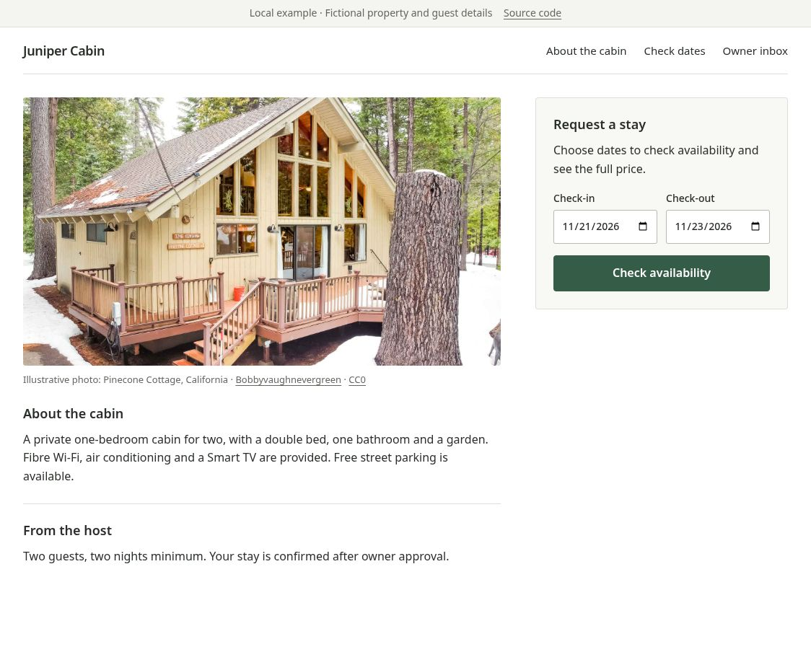

# Booking Engine

**Build your own rental website. Bring the booking backend.**

A self-hostable booking backend for developers building custom cabin, villa and holiday-rental
websites. Keep control of your frontend; use the engine for availability, quotes and
owner-approved booking requests.

[Run the cabin demo](#quickstart) · [Integration tutorial](docs/tutorials/build-a-property-booking-site.md) · [TypeScript SDK](packages/sdk-typescript/README.md) · [Self-hosting](docs/deployment/self-host.md)

MIT licensed · **Prerelease, for evaluation** · Live payments, email and background calendar sync are not active.



## What it handles

- Property content, guest capacity and amenities through a public API.
- Calendar-date availability and quotes with nightly rates, cleaning fees and minimum stays.
- Idempotent request-to-book submissions and owner approval or rejection.
- PostgreSQL occupancy protection, scoped persistence and authenticated owner operations.
- A dependency-free TypeScript client and a runnable guest website and owner inbox.

A pending request does **not** reserve dates. Approval checks availability again and creates
occupancy. This is a property request-to-book workflow, with your own frontend and deployment.

> **Prerelease:** The runtime is not recommended for production traffic. Live payments, email
> delivery and background calendar sync are not active. The example owner inbox is local and
> limited to the latest 100 requests. The SDK `0.1.0` is an unpublished release candidate;
> use the workspace or packed tarball until registry publication. See [release status](CHANGELOG.md),
> [support scope](SUPPORT.md), and [release procedure](RELEASING.md).

## A small client surface

```ts
import { createBookingEngineClientV1 } from '@booking-engine/sdk-typescript';

const client = createBookingEngineClientV1({
  baseUrl: 'http://127.0.0.1:13000',
  defaultPropertyId: 'sample-bungalow',
});

const property = await client.getPublicProperty();
const stay = { arrival: '2026-10-10', departure: '2026-10-12' };
const availability = await client.getAvailability(property.id, stay);
const quote = await client.getQuote(property.id, stay);
```

Use future, available dates. The [tutorial](docs/tutorials/build-a-property-booking-site.md) adds
submission, retries and the owner decision. The demo's browser uses the compiled SDK on the same
origin; the snippet above can run in Node with a locally packed SDK.

## Prerequisites

- Node.js `22.23.1`;
- pnpm `10.12.1` through Corepack;
- Docker Engine and Compose for the quickstart and PostgreSQL-backed checks.

## Quickstart

Create the ignored local environment file with the command for your shell.

Linux, macOS, or a POSIX shell such as Windows Git Bash:

```sh
cp .env.example .env
```

Windows PowerShell:

```powershell
Copy-Item .env.example .env
```

Windows Command Prompt:

```bat
copy .env.example .env
```

On Windows Git Bash, PowerShell, or Command Prompt, use `corepack.cmd pnpm` if the
extensionless `corepack` shim fails. Replace `corepack pnpm` with `corepack.cmd pnpm`
for the install command and every later pnpm command.

Install the frozen dependencies, then start the seeded app and its services in Compose:

```text
corepack pnpm install --frozen-lockfile
docker compose up --build --detach --wait --wait-timeout 120
corepack pnpm demo
```

Open **[Juniper Cabin](http://127.0.0.1:13001)**. Choose dates, review a quote, and send a fictional
request. Open the owner inbox, select **Use local demo login**, sign in, and approve the request.
Return to the guest tab and refresh its decision. Those dates should now be unavailable to new
stays. See the [example guide](examples/cabin/README.md) for ports, troubleshooting and limitations.

The example uses the real API and PostgreSQL. Keep its terminal open. Ctrl+C stops the website;
`docker compose stop` stops the API and database while keeping the data. This example runs only
on your computer; it is not a public hosted sandbox.

Compose waits for at most 120 seconds for PostgreSQL and the app to pass their health checks. A
timeout or unhealthy service makes the command fail; stop the Quickstart and inspect the service
logs instead of continuing to smoke checks. The Compose app sets its database URL to the Compose
PostgreSQL service and fixes the local environment, sample flag, and sample password in the same
service configuration. The copied template keeps sample seeding disabled for host-started
processes.

The start, migration, database-check, backup/restore, and integration-test commands load the
complete optional `.env` file only when no deployment identity variable is exported. If any
deployment identity variable is exported, the commands ignore `.env` and use only the process
environment. Supply a complete process environment; the commands do not merge deployment
identity values from both sources.

In a second terminal, you can also inspect the API directly:

```sh
curl http://127.0.0.1:13000/healthz
curl http://127.0.0.1:13000/v1/properties/sample-bungalow
curl http://127.0.0.1:13000/admin/login
```

On Windows PowerShell or Command Prompt, use `curl.exe` in place of `curl`. The owner admin is
same-origin and server-rendered by `apps/api`. It is a reference surface, not a browser-admin
SDK. For an unseeded API process running on the host, use the
[host development flow](docs/deployment/self-host.md#host-development-flow).

## Development and release gates

The checklist below is the authoritative release command list. The CI workflow and root scripts
define command behavior. The [verification guide](docs/verification.md) maps checks to behavior.
Run every command from the repository root:

```sh
corepack pnpm format:check
corepack pnpm lint
corepack pnpm typecheck
corepack pnpm test
corepack pnpm test:integration
corepack pnpm backup:restore -- --confirm-database replace_me_local_database
corepack pnpm build
corepack pnpm check:architecture
corepack pnpm check:public-boundary
corepack pnpm check:public-contract
corepack pnpm check:sdk-package
corepack pnpm check:env
corepack pnpm scan:secrets
corepack pnpm scan:history
corepack pnpm audit:dependencies
git diff --check main...HEAD
git diff --cached --check
git diff --check
docker compose config --quiet
corepack pnpm docker:clean-room
```

For `backup:restore`, replace `replace_me_local_database` with the exact database name decoded
from the effective `DATABASE_URL`. The explicit confirmation must match that decoded name. Retain
the successful backup/restore rehearsal result with the release evidence.

The `main...HEAD` diff checks committed branch changes from the merge base with `main`.
The `--cached` diff checks staged changes. The plain diff checks unstaged changes.

The Docker clean-room gate is mandatory for every release. It verifies Docker packaging, startup,
smoke, and backup/restore behavior. A running Docker Engine is required. If Docker Engine is
unavailable, the release is blocked; mocked evidence does not replace the gate.

The dependency audit includes development tooling and fails on moderate or higher advisories.
The [secret-scanning policy](docs/security/secret-scanning.md) documents scan coverage and the
exact historical sample exceptions.

Integration tests use isolated schemas. CI supplies a PostgreSQL service URL on port `5432`;
the documented local Compose flow uses host port `15432`.

## Ownership and dependency direction

| Area                         | Responsibility                                                                      | Release boundary            |
| ---------------------------- | ----------------------------------------------------------------------------------- | --------------------------- |
| `apps/api`                   | HTTP composition, public booking transport, same-origin server-rendered owner admin | private                     |
| `packages/booking-core`      | domain invariants, local dates, money, quotes, lifecycle rules                      | private                     |
| `packages/database-postgres` | scoped PostgreSQL persistence, migrations, canonical projections                    | private                     |
| `packages/payments`          | payment ports and test-mode lifecycle contracts                                     | private                     |
| `packages/payments-stripe`   | Stripe adapter seam; not activated by the runtime                                   | private                     |
| `packages/channel-ical`      | iCalendar adapter and port                                                          | private                     |
| `packages/sdk-typescript`    | dependency-free V1 consumer contract and client                                     | **intended public `0.1.x`** |

The intended workspace edges are:

```text
payments-stripe -> payments
database-postgres -> booking-core, payments, channel-ical
apps/api -> booking-core, database-postgres, channel-ical, payments, sdk-typescript
```

Persistence returns canonical domain properties. Only the API mapper serializes SDK V1 property
responses. External storefronts use the SDK and public HTTP contract; they do not import admin,
database, or domain internals.

See [`docs/architecture.md`](docs/architecture.md),
[`docs/adr/0001-modular-monolith.md`](docs/adr/0001-modular-monolith.md), and
[`docs/adr/0006-open-source-release-boundary.md`](docs/adr/0006-open-source-release-boundary.md).

## Documentation

- [`examples/cabin/README.md`](examples/cabin/README.md) — runnable cabin and owner demo;
- [`docs/tutorials/build-a-property-booking-site.md`](docs/tutorials/build-a-property-booking-site.md) — integration walkthrough;
- [`docs/architecture.md`](docs/architecture.md) — maintainer map and invariants;
- [`docs/verification.md`](docs/verification.md) — behavior covered by automated checks;
- [`docs/deployment/self-host.md`](docs/deployment/self-host.md) — deployment flow;
- [`docs/operations/owner-runbook.md`](docs/operations/owner-runbook.md) — owner operations;
- [`docs/security/threat-model.md`](docs/security/threat-model.md) — security assumptions and
  deployment-owned controls;
- [`CONTRIBUTING.md`](CONTRIBUTING.md) — development and migration policy;
- [`SECURITY.md`](SECURITY.md) — vulnerability reporting;
- [`RELEASING.md`](RELEASING.md) — versioning, release gates, and SDK publication;
- [`SUPPORT.md`](SUPPORT.md) — support scope and issue routes;
- [`CHANGELOG.md`](CHANGELOG.md) — release history and current status;
- [`packages/sdk-typescript/README.md`](packages/sdk-typescript/README.md) — public client usage.

## License

MIT. See [`LICENSE`](LICENSE).
